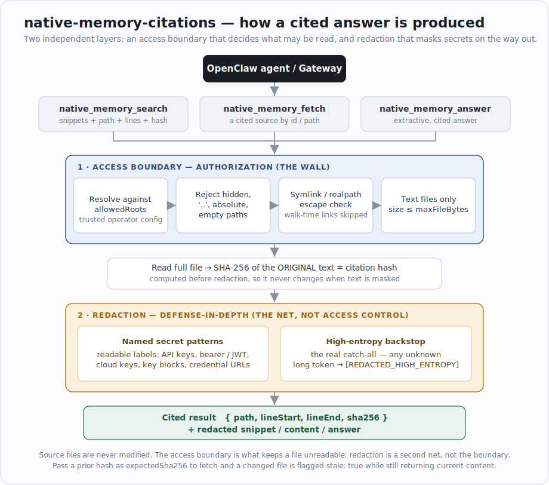

# Native Memory Citations

Native OpenClaw plugin for cited local memory search and retrieval.
Native means OpenClaw-native plugin, not native system memory.



## Tools

- `native_memory_search`: search approved memory roots and return snippets with source paths, line numbers, and file SHA-256 hashes.
- `native_memory_fetch`: fetch a cited source by `sourceId` or safe path, optionally checking an expected citation hash.
- `native_memory_answer`: build an extractive answer from cited memory snippets; says when no cited memory is found.

## Default Scope

By default, the plugin searches:

- `memory/`
- `MEMORY.md`
- `USER.md`
- `IDENTITY.md`
- `TOOLS.md`

Set `sharedMode: true` in plugin config to exclude the private `MEMORY.md` from
the default root set. Setting `allowedRoots` explicitly overrides the default
set entirely and supersedes `sharedMode`.

Custom `allowedRoots` entries must be workspace-relative visible paths. Empty
entries, `.`, `..`, paths containing `..`, absolute paths, and hidden path
segments such as `memory/.dreams` are rejected.

## Build, Generate, Validate

The manifest (`openclaw.plugin.json`) is generated from the `defineToolPlugin`
metadata in `src/index.ts`. Do not hand-edit it; regenerate after changing the
plugin id, name, description, `configSchema`, or any tool name:

```bash
npm install
npm test
npm run plugin:build
npm run plugin:validate
```

In CI, fail on stale generated metadata without rewriting files:

```bash
npm run plugin:build:check
npm run plugin:validate
npm test
```

## Configuration

Plugin configuration is supplied in the plugin's entry within the OpenClaw Gateway
configuration. It governs which files the plugin is permitted to read and cite. The
plugin reads existing memory files only; it does not create, modify, or delete them.
All keys are optional.

| Key | Type | Default | Description |
|-----|------|---------|-------------|
| `workspace` | string | `$OPENCLAW_WORKSPACE`, then `~/.openclaw/workspace` | Absolute path against which roots are resolved. |
| `allowedRoots` | string[] | Built-in default set (see Default Scope) | Workspace-relative files or directories to search. When set to a non-empty array, it replaces the default set in full. |
| `sharedMode` | boolean | `false` | When `true`, excludes the private `MEMORY.md` from the default set. Has no effect when `allowedRoots` is set. |
| `maxFileBytes` | number | `1048576` (1 MiB) | Per-file size limit. Files exceeding this limit are skipped rather than reported as errors. |

### Default search scope

The default roots are defined in the Default Scope section above: `memory/`,
`MEMORY.md`, `USER.md`, `IDENTITY.md`, and `TOOLS.md`. With `sharedMode: true`,
`MEMORY.md` is excluded.

### Defining custom roots

Set `allowedRoots` to the exact set of workspace-relative files or directories that
should be searchable. This value replaces the default set in full and takes
precedence over `sharedMode`. Any default entries that should remain searchable must
be listed explicitly.

Each entry must be a workspace-relative, visible path. An entry is rejected, with an
`Invalid allowedRoots entry` error, if it is empty, `.`, `..`, an absolute path,
contains a `..` segment, or contains a hidden segment (a segment beginning with `.`,
for example `memory/.dreams`). These restrictions are part of the access boundary
and are enforced intentionally.

### Examples

Shared or team deployment, retaining the defaults while excluding the private
journal:

```json
{ "sharedMode": true }
```

Restricting the plugin to a specific, minimal set:

```json
{ "allowedRoots": ["memory", "USER.md"] }
```

Adding custom directories. Because `allowedRoots` replaces the default set, any
defaults that should remain searchable are listed again:

```json
{ "allowedRoots": ["memory", "USER.md", "IDENTITY.md", "TOOLS.md", "notes", "decisions"] }
```

Permitting larger files (4 MiB) and specifying a non-default workspace:

```json
{ "workspace": "/srv/openclaw/workspace", "maxFileBytes": 4194304 }
```

### Operational notes

- `allowedRoots` replaces the default set; it does not extend it. A value of
 `["notes"]` makes `MEMORY.md`, `USER.md`, and the remaining defaults unreachable.
 List every path that should remain searchable.
- `sharedMode` has no effect once `allowedRoots` is set; the explicit list takes
 precedence.
- Files exceeding `maxFileBytes` are skipped and logged rather than reported as
 errors. Set the limit to accommodate the largest memory files in use.
- Hidden directories, `..` segments, and absolute paths cannot be included. This is
 enforced by the access boundary.

### Settings not exposed through configuration

Redaction is implemented in code and is not configurable through plugin
configuration; the schema rejects unrecognized keys. The named secret patterns and
the high-entropy backstop are defined in `src/core.ts`. Modifying redaction behavior
requires editing that file and re-running the test suite (`npm test`) to confirm
that the redaction invariants continue to hold. It is not a configuration setting in
this version.

### Per-request limit

`native_memory_fetch` accepts a `maxChars` argument (default `8000`, constrained to
the range 256 to 20000) that bounds the amount of cited content returned by a single
fetch. This is a per-call tool argument and is independent of plugin configuration.

## Notes

This v1 is intentionally local-file based. It is portable and dependency-light.
A future version can add vector search while keeping the same public tool names.
Search is keyword/substring based with an mtime/size line cache, bounded scan
concurrency, and `AbortSignal` checks during scan.

Returned snippets, fetched content, match lines, and extractive answers are
redacted for common secret patterns such as bearer tokens, API keys, GitHub
tokens, password/secret/token assignment lines, credential URLs, JWTs, cloud
keys, and private key blocks. The named pattern list is best-effort labeling,
not the security boundary; returned text also masks sufficiently long
high-entropy tokens when no named pattern matches. Redaction is defense-in-depth,
not the access boundary; the access boundary is allowed roots, hidden-path
rejection, symlink/realpath checks, file-type filtering, and size limits.
Redaction does not mutate source files and does not affect citation hashes,
which are computed from original file text.

## Citation Integrity

Search hits include `sha256`, computed from the full text file used for line
splitting and citation line numbers. Fetch results include the current `sha256`
for the same full-file content.

To detect stale citations, pass the hash from a prior search hit:

```json
{
  "sourceId": "memory/2026-06-17.md",
  "lineStart": 12,
  "lineEnd": 14,
  "expectedSha256": "..."
}
```

If the file changed, fetch still returns the current content for inspection, but
marks the result with `stale: true` and a `staleMessage` explaining the hash
mismatch. Because hashes cover the full file, appending to a daily journal marks
earlier citations stale even when the cited lines themselves are unchanged.

## Install

From npm (recommended):

 openclaw plugins install @ngo-a/native-memory-citations

From a local checkout (development):

 openclaw plugins install ./native-memory-citations

Reload the Gateway after installing so the plugin host exposes the tools.

## Security Model

See [SECURITY.md](./SECURITY.md): `allowedRoots` is trusted operator config;
a symlink that escapes a root, and any caller-supplied fetch path, is untrusted
and re-checked with `realpath`; symlinks found while walking directories during
search are skipped. Fetch also rejects hidden path segments, non-text files, and
files larger than `maxFileBytes`. Citation hashes let callers detect when a
previous path-and-line citation may now point at changed content. Returned text
is redacted before it leaves the plugin; named secret patterns provide nicer
labels, while the high-entropy backstop handles unknown token formats. Redaction
is not an authorization or access-control boundary.

## Releasing

Published to npm as `@ngo-a/native-memory-citations`.

To cut a new release:

1. Make changes and confirm the suite is green: `npm test`
2. Bump `version` in `package.json` (e.g. `0.1.0` -> `0.1.1`) per semver.
3. `npm publish`

The `prepublishOnly` script rebuilds `dist/` first, and `publishConfig.access`
is `public`, so no extra flags are needed. A published version number cannot be
overwritten; fixes ship as a new version.

## License

[MIT](./LICENSE)

## Changelog

See [CHANGELOG.md](./CHANGELOG.md).
